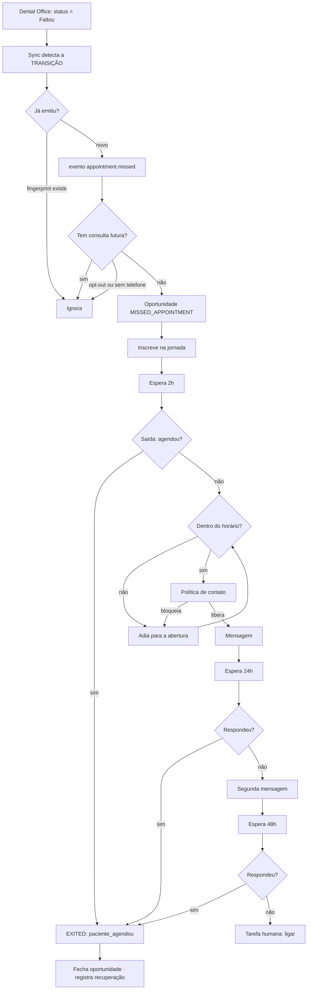

# ARCHITECTURE — JP CRC OS

## A ideia em uma frase

> **Antes de planejar qualquer coisa nova:** leia
> [CAPACIDADES-DENTAL-OFFICE](CAPACIDADES-DENTAL-OFFICE.md). A API v1.0 deles
> expõe pacientes, dentistas, agenda e cadeiras — e **não** expõe financeiro,
> orçamento nem webhooks. Existir no produto Dental Office não é existir na
> API, e foi por confundir os dois que o adapter nasceu falando com endpoints
> que não existem.

O Dental Office continua sendo o sistema clínico. O JP CRC transforma o que
acontece lá — faltas, cancelamentos, silêncios longos — em **oportunidades**,
que viram **jornadas**, que viram **contato**, que vira **agendamento**.

```
PACIENTE → EVENTO → REGRA → OPORTUNIDADE → JORNADA → AÇÃO → RESULTADO
```

## Camadas

```
src/lib/crc/
├── dominio/        PURO. Zero import de node:, servidor ou React.
│                   Tipos, regras, score, telefone, horário, RBAC, rótulos.
│                   É o que os 178 testes cobrem sem subir banco.
│
├── aplicacao/      Casos de uso. Orquestra domínio + infra.
│                   eventos, sincronizacao, oportunidades, tarefas,
│                   mensagens, ia, webhooks, repositorios.
│
├── automacao/      O motor de jornadas, o catálogo e os handlers de evento.
│
├── integracoes/    Uma pasta por sistema externo, cada uma atrás de uma porta.
│   ├── dental-office/   auth · cliente · mapeadores · sandbox
│   ├── whatsapp/        porta · provedores (Meta Cloud + sandbox)
│   └── ia/              porta · provedor (OpenAI + sandbox)
│
├── servidor/       Só servidor. banco, http, registro, sessao, configuracao.
└── api.ts          Server functions. A fronteira com a tela.
```

**A regra que sustenta tudo:** a dependência aponta para dentro. `dominio` não
conhece ninguém; `integracoes` implementa interfaces que `aplicacao` define;
`api.ts` é o único lugar que o React importa.

## Por que este desenho, e não outro

### Monólito modular, não microserviços (item 266)

O projeto já é um monólito na Vercel. Fatiar em serviços exigiria fila,
descoberta e observabilidade distribuída para resolver um problema que não
existe: a clínica tem uma unidade e alguns milhares de pacientes.

### Banco como barramento, não uma fila de verdade (item 267)

Eventos, jornadas e jobs vivem em tabelas com estado, e um cron varre. Numa
função serverless, o banco é a única coisa que sobrevive entre invocações de
qualquer jeito — e isso já entrega durabilidade, replay e idempotência.

A parte que **não** dava para fazer via REST foi `FOR UPDATE SKIP LOCKED`.
Três funções em plpgsql (`crc_reservar_jobs`, `crc_reservar_eventos`,
`crc_reservar_jornadas`) resolvem a reserva atômica. Sem elas, duas execuções
sobrepostas do cron pegariam a mesma jornada e mandariam a mesma mensagem duas
vezes.

### REST puro no Supabase, sem SDK

Mesma escolha que o portal de RH fez, pelo mesmo motivo: o projeto tem cinco
dependências de runtime, todas React/TanStack. PostgREST é HTTP com
querystring.

## Os quatro fluxos que definem o sistema

### 1. Sincronização → evento

```
Dental Office → cliente → mapeador → upsert → COMPARA STATUS ANTERIOR → evento
```

A comparação é o ponto. `appointment.missed` sai quando o agendamento **passa**
para MISSED, não quando ele **está** MISSED. Sem isso, a primeira sincronização
emitiria evento para toda falta histórica — e o sistema estrearia disparando
milhares de mensagens sobre consultas de anos atrás.

### 2. Evento → oportunidade → jornada

```
handler → confere se ainda faz sentido → cria oportunidade → inscreve na jornada
```

Nessa ordem, e não outra: a oportunidade é o registro permanente, a jornada é o
esforço. Se a inscrição falhar, a oportunidade continua na fila de alguém. É a
diferença entre "a automação não rodou" e "o paciente foi esquecido".

### 3. Jornada → mensagem

```
worker → reserva atômica → avalia SAÍDAS → executa passo → grava resume_at
```

As saídas são avaliadas **antes de cada passo**, e não só na entrada. O mundo
muda durante a espera: a jornada de falta espera duas horas, e nesse intervalo
o paciente pode ter ligado e remarcado.

### 4. Resposta → classificação → ação

```
webhook → assinatura → inbox → mensagem → opt-out por regra → evento → IA
```

O opt-out é detectado por regex **antes** da IA. Os dois erros têm custo
assimétrico: falso positivo cala o sistema para quem não pediu (reversível);
falso negativo continua mandando mensagem para quem pediu para parar (quebra de
confiança e problema de LGPD).

## O que impede duplicação

Toda a idempotência é **constraint no banco**, não cuidado no código:

| O quê                | Chave                                                                       |
| -------------------- | --------------------------------------------------------------------------- |
| Paciente/agendamento | `unique(organization_id, external_source, external_id)`                     |
| Evento               | `unique(organization_id, fingerprint)`                                      |
| Oportunidade         | `unique(organization_id, chave_dedupe) where fechada_em is null`            |
| Tarefa               | `unique(organization_id, chave_dedupe) where status in (OPEN, IN_PROGRESS)` |
| Mensagem recebida    | `unique(organization_id, provider_message_id)`                              |
| Mensagem enviada     | `unique(organization_id, chave_dedupe)`                                     |
| Jornada              | `unique(organization_id, automation_id, chave_dedupe)`                      |
| Webhook              | `unique(provedor, external_id)`                                             |

Os índices parciais importam: uma oportunidade fechada libera a chave, porque o
paciente faltar de novo no mês seguinte é outro fato.

## O que sustenta a confiança do paciente

`podeContatar()` é o guarda-costas do item 286, e **todo** envio passa por ele.
Não existe caminho alternativo — é por isso que ele mora no domínio, e não
dentro do motor:

```
opt-out → SEM_TELEFONE → humano atendendo → outra jornada → limite diário
→ cooldown → horário comercial
```

A distinção entre bloqueio **definitivo** e **adiável** é o que torna isso
utilizável: fora de horário a jornada é reagendada para a abertura seguinte;
opt-out a encerra.

## Segurança

- Toda tabela com RLS ligado e **zero policies**. Só a `service_role` enxerga.
- Toda operação passa por `autorizar()`, que produz o `ContextoCrc` — e as
  operações **pedem** esse contexto. Não dá para escrever um caso de uso que
  esqueça de verificar: ele não compila sem o contexto.
- Escopo de clínica entra como **filtro de consulta**, nunca como conferência
  depois de ler.
- Secret nunca vai ao navegador, nunca ao log, nem truncado.
- Webhook exige assinatura conferida sobre o corpo cru, em tempo constante.

## Diagrama do fluxo de recuperação de falta



## Onde as decisões estão explicadas

Cada arquivo tem um cabeçalho dizendo **por que** ele é assim, não o que ele
faz. Os que mais valem a leitura:

- `dominio/regras.ts` — a política de contato e as condições.
- `aplicacao/sincronizacao.ts` — a detecção por transição.
- `aplicacao/mensagens.ts` — "grava antes de mandar".
- `automacao/motor.ts` — esperas duráveis e os três modos.
- `aplicacao/ia.ts` — os quatro guardrails.
- `supabase/02-crc-schema.sql` — por que colunas reais e não jsonb.
